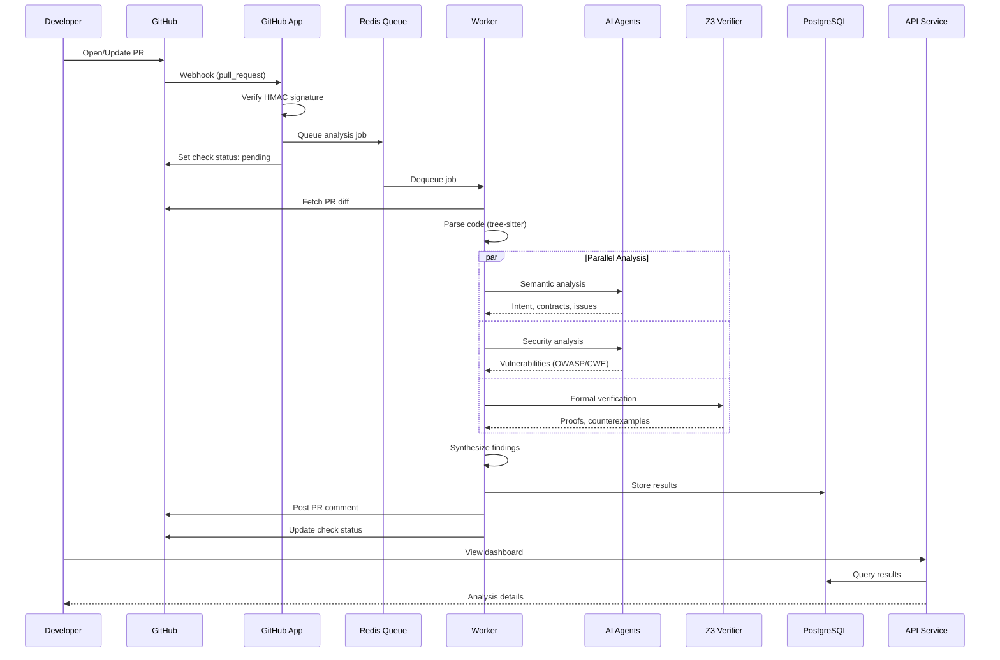

# CodeVerify

AI-powered code review with formal verification. Catch bugs, security vulnerabilities, and logical errors in code—particularly code generated by AI coding assistants.

[](https://github.com/codeverify/codeverify/actions/workflows/ci.yml)
[](https://opensource.org/licenses/MIT)

## 🚀 Features

### Core Analysis
- **AI Semantic Analysis**: LLM-powered understanding of code intent, logic, and potential issues
- **Formal Verification**: Z3 SMT solver provides mathematical proofs for:
  - Null safety violations
  - Array bounds checking
  - Integer overflow detection
  - Division by zero prevention
- **GitHub Integration**: Seamless PR checks, inline comments, and suggested fixes
- **Multi-Language**: Supports Python and TypeScript (more coming soon)
- **Configurable**: Per-repository settings via `.codeverify.yml`
- **Team Dashboard**: Track metrics, trends, and findings across your organization

### Next-Gen Features
- **🎯 Copilot Trust Score**: ML-powered scoring of AI-generated code with risk assessment
- **🔌 Multi-VCS Support**: GitHub, GitLab, and Bitbucket integration
- **🐛 Verification Debugger**: Step-through Z3 constraint visualization
- **📝 Custom Rule Builder**: No-code rule creation with pattern, AST, and semantic rules
- **📊 AI Diff Summarizer**: Auto-generated PR descriptions and changelogs
- **🔍 Codebase-Wide Scanning**: Scheduled full-repo analysis with trend tracking
- **💬 Slack/Teams Notifications**: Real-time alerts for findings and scan results
- **🌐 Public API**: RESTful API with webhooks for CI/CD integration
- **💻 VS Code Extension**: Real-time verification as you code

## 📋 Overview

CodeVerify combines the intelligence of large language models with the rigor of formal methods to catch bugs that traditional static analysis misses—especially important for AI-generated code.

```mermaid
flowchart TB
    subgraph Input["📥 Input"]
        PR[GitHub PR]
        CLI[CLI Tool]
        IDE[VS Code Extension]
    end

    subgraph GHA["🔗 GitHub App"]
        WH[Webhook Handler]
        Q[Redis Queue]
    end

    subgraph Worker["⚙️ Analysis Worker"]
        direction TB
        Parse[Parse Code]
        
        subgraph Agents["🤖 AI Agents"]
            direction LR
            Semantic[Semantic Agent<br/>GPT-4/Claude]
            Security[Security Agent<br/>OWASP/CWE]
        end
        
        subgraph Verifier["🔬 Formal Verifier"]
            Z3[Z3 SMT Solver]
        end
        
        Synthesis[Synthesis Agent]
    end

    subgraph Output["📤 Output"]
        Comment[PR Comment]
        Check[GitHub Check]
        Dashboard[Web Dashboard]
        SARIF[SARIF Report]
    end

    subgraph Data["💾 Data Layer"]
        PG[(PostgreSQL)]
        Redis[(Redis)]
    end

    PR --> WH
    CLI --> Parse
    IDE --> Parse
    WH --> Q --> Parse
    Parse --> Agents
    Parse --> Verifier
    Agents --> Synthesis
    Verifier --> Synthesis
    Synthesis --> Comment
    Synthesis --> Check
    Synthesis --> Dashboard
    Synthesis --> SARIF
    Synthesis --> PG
    Q --> Redis
```



## 📦 Project Structure

```
codeverify/
├── apps/
│   ├── api/              # FastAPI backend service
│   ├── worker/           # Celery analysis workers
│   ├── web/              # Next.js dashboard
│   └── github-app/       # GitHub webhook handler
├── packages/
│   ├── core/             # Shared models, rules, notifications
│   ├── verifier/         # Z3 formal verification + debugger
│   ├── ai-agents/        # LLM agents (semantic, security, trust score, diff)
│   ├── cli/              # Command-line interface
│   ├── z3-mcp/           # Z3 MCP server (open source)
│   └── vscode-extension/ # VS Code extension for real-time verification
├── docker/               # Docker configurations
├── docs/                 # Documentation
│   └── api/              # API documentation
└── scripts/              # Development utilities
```

## 🏃 Quick Start

### Prerequisites

- Python 3.11+
- Node.js 20+
- Docker & Docker Compose
- GitHub App credentials (for PR integration)

### 1. Clone and Configure

```bash
git clone https://github.com/codeverify/codeverify.git
cd codeverify

# Copy environment template
cp .env.example .env
# Edit .env with your credentials
```

### 2. Start with Docker Compose

```bash
# Start all services
docker compose up -d

# View logs
docker compose logs -f api worker
```

Or for development:

```bash
# Start infrastructure only
docker compose up -d postgres redis

# Install Python packages
pip install -e "packages/core" \
            -e "packages/verifier" \
            -e "packages/ai-agents" \
            -e "apps/api[dev]" \
            -e "apps/worker[dev]"

# Install Node.js packages
cd apps/web && npm install && cd ../..
cd apps/github-app && npm install && cd ../..

# Run migrations
cd apps/api && alembic upgrade head && cd ../..

# Start services (in separate terminals)
uvicorn codeverify_api.main:app --reload      # API on :8000
celery -A codeverify_worker.main worker       # Worker
cd apps/web && npm run dev                     # Dashboard on :3000
cd apps/github-app && npm run dev              # GitHub App on :3001
```

### 3. Validate Environment

```bash
python scripts/validate_env.py
```

## ⚙️ Configuration

### Repository Configuration (`.codeverify.yml`)

```yaml
version: "1"

languages:
  - python
  - typescript

verification:
  enabled: true
  checks:
    - null_safety
    - array_bounds
    - integer_overflow

ai:
  enabled: true
  semantic: true
  security: true

thresholds:
  critical: 0   # Fail on any critical
  high: 0       # Fail on any high
  medium: 5     # Allow up to 5 medium
  low: 10       # Allow up to 10 low

exclude:
  - "node_modules/**"
  - "venv/**"
  - "tests/**"
```

See [docs/examples/](docs/examples/) for more configuration examples.

### Environment Variables

| Variable | Required | Description |
|----------|----------|-------------|
| `DATABASE_URL` | Yes | PostgreSQL connection string |
| `REDIS_URL` | Yes | Redis connection string |
| `GITHUB_APP_ID` | Yes | GitHub App ID |
| `GITHUB_APP_PRIVATE_KEY` | Yes | GitHub App private key (PEM) |
| `GITHUB_WEBHOOK_SECRET` | Yes | Webhook signing secret |
| `JWT_SECRET` | Yes | Secret for JWT tokens |
| `OPENAI_API_KEY` | No* | OpenAI API key |
| `ANTHROPIC_API_KEY` | No* | Anthropic API key |

*At least one LLM API key is required for AI analysis.

## 🧪 Running Tests

```bash
# All tests
./scripts/test.sh

# Specific packages
pytest packages/verifier/tests -v
pytest packages/ai-agents/tests -v
pytest apps/api/tests -v
pytest apps/worker/tests -v

# With coverage
pytest --cov=codeverify --cov-report=html
```

## 📚 Documentation

- **[Getting Started](docs/getting-started.md)** - Full setup guide
- **[API Reference](docs/api-reference.md)** - REST API documentation
- **[Architecture](docs/architecture/overview.md)** - System design
- **[Verification](docs/verification.md)** - Z3 formal verification deep-dive
- **[Custom Rules](docs/custom-rules.md)** - Creating custom rules
- **[Next-Gen Features](docs/nextgen-features.md)** - v0.3.0 features guide
- **[Troubleshooting](docs/troubleshooting.md)** - Common issues and solutions
- **[Configuration Examples](docs/examples/)** - Sample `.codeverify.yml` files

## 🛠️ Development

### Architecture

- **API Service**: FastAPI with async SQLAlchemy
- **Worker**: Celery with Redis for job queue
- **Dashboard**: Next.js 14 with Tailwind CSS
- **Database**: PostgreSQL with Alembic migrations
- **Verification**: Z3 SMT solver Python bindings

### Data Flow



### Key Technologies

| Component | Technology |
|-----------|------------|
| API | Python, FastAPI, SQLAlchemy |
| Worker | Python, Celery, Z3 |
| AI Agents | OpenAI GPT-4, Anthropic Claude |
| Dashboard | Next.js, React, Tailwind CSS |
| GitHub App | Node.js, Express, Octokit |
| Database | PostgreSQL |
| Queue | Redis |

### Adding a New Verification Check

1. Add the check to `packages/verifier/src/codeverify_verifier/z3_verifier.py`
2. Add tests in `packages/verifier/tests/`
3. Update the config schema in `packages/core/src/codeverify_core/config.py`
4. Document in `docs/verification.md`

### Adding a New AI Agent

1. Create the agent in `packages/ai-agents/src/codeverify_agents/`
2. Inherit from `BaseAgent` and implement `analyze()` method
3. Add tests in `packages/ai-agents/tests/`
4. Register in the analysis pipeline

## 📈 Roadmap

- [ ] **Go language support**
- [ ] **Java language support**
- [ ] **VSCode extension**
- [ ] **Slack/Discord notifications**
- [ ] **Custom rule builder**
- [ ] **SOC 2 compliance**

## 🤝 Contributing

We welcome contributions! Please see [CONTRIBUTING.md](CONTRIBUTING.md) for guidelines.

1. Fork the repository
2. Create a feature branch (`git checkout -b feature/amazing-feature`)
3. Make your changes
4. Run tests (`./scripts/test.sh`)
5. Submit a pull request

## 📄 License

MIT License - see [LICENSE](LICENSE) for details.

## 🙏 Acknowledgments

- [Z3 Theorem Prover](https://github.com/Z3Prover/z3) - SMT solver
- [OpenAI](https://openai.com) / [Anthropic](https://anthropic.com) - LLM providers
- [FastAPI](https://fastapi.tiangolo.com) - API framework
- [Next.js](https://nextjs.org) - Dashboard framework
