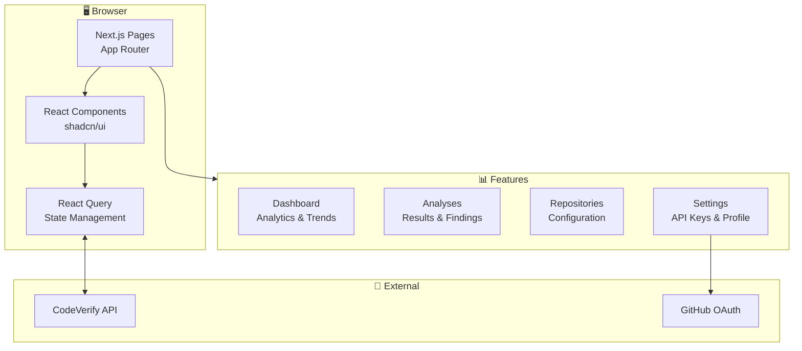

# CodeVerify Web Dashboard

Next.js web dashboard for CodeVerify.

[](https://nextjs.org/)
[](https://www.typescriptlang.org/)
[](https://tailwindcss.com/)

## Overview

The web dashboard provides:

- Team analytics and trends
- Analysis result viewing
- Repository configuration
- Organization management
- User settings and API keys

## Architecture



## Quick Start

### Prerequisites

- Node.js 20+
- npm or yarn

### Development Setup

```bash
cd apps/web

# Install dependencies
npm install

# Set environment variables
cp .env.example .env.local

# Start development server
npm run dev
```

Open http://localhost:3000

### Using Docker

```bash
docker compose up web
```

## Project Structure

```
apps/web/
├── src/
│   ├── app/                    # Next.js App Router
│   │   ├── (auth)/            # Auth pages (login, callback)
│   │   ├── (dashboard)/       # Dashboard pages
│   │   │   ├── page.tsx       # Dashboard home
│   │   │   ├── analyses/      # Analysis list & details
│   │   │   ├── repositories/  # Repository management
│   │   │   └── settings/      # User & org settings
│   │   ├── layout.tsx
│   │   └── globals.css
│   ├── components/
│   │   ├── ui/                # Shadcn/ui components
│   │   ├── analyses/          # Analysis-related components
│   │   ├── charts/            # Chart components
│   │   └── layout/            # Layout components
│   ├── lib/
│   │   ├── api.ts             # API client
│   │   ├── auth.ts            # Auth utilities
│   │   └── utils.ts           # Helpers
│   └── hooks/                 # React hooks
├── public/
├── e2e/                       # Playwright tests
├── next.config.js
├── tailwind.config.js
└── package.json
```

## Pages

### Dashboard (`/`)

Overview with:
- Analysis pass rate
- Finding trends chart
- Recent activity feed
- Quick stats

### Analyses (`/analyses`)

- List all analyses with filters
- Search by repository, status, date
- Pagination

### Analysis Detail (`/analyses/[id]`)

- Analysis summary
- Findings list with severity badges
- Code snippets with line highlighting
- Fix suggestions

### Repositories (`/repositories`)

- List connected repositories
- Enable/disable analysis
- Configure per-repo settings

### Settings (`/settings`)

- User profile
- API keys management
- Notification preferences
- Organization settings

## Configuration

### Environment Variables

```bash
# API endpoint
NEXT_PUBLIC_API_URL=http://localhost:8000

# GitHub OAuth
NEXT_PUBLIC_GITHUB_CLIENT_ID=your-client-id

# Analytics (optional)
NEXT_PUBLIC_POSTHOG_KEY=your-key
```

### Tailwind CSS

Custom theme in `tailwind.config.js`:

```javascript
module.exports = {
  theme: {
    extend: {
      colors: {
        primary: {...},
        severity: {
          critical: '#ef4444',
          high: '#f97316',
          medium: '#eab308',
          low: '#3b82f6',
        },
      },
    },
  },
}
```

## Components

### UI Components

Using [shadcn/ui](https://ui.shadcn.com/):

```bash
# Add a new component
npx shadcn-ui@latest add button
```

### Charts

Using [Recharts](https://recharts.org/):

```tsx
import { TrendChart } from '@/components/charts/TrendChart';

<TrendChart
  data={analysisData}
  xKey="date"
  yKey="passRate"
/>
```

### Finding Card

```tsx
import { FindingCard } from '@/components/analyses/FindingCard';

<FindingCard
  finding={finding}
  showCode={true}
  onDismiss={handleDismiss}
/>
```

## API Client

```typescript
import { api } from '@/lib/api';

// List analyses
const analyses = await api.analyses.list({
  repositoryId: 'repo_123',
  status: 'completed',
});

// Get analysis details
const analysis = await api.analyses.get('analysis_123');

// Get findings
const findings = await api.analyses.getFindings('analysis_123');
```

## Authentication

Using GitHub OAuth:

```typescript
import { signIn, signOut, useSession } from '@/lib/auth';

// In component
const { user, isLoading } = useSession();

// Sign in
await signIn();

// Sign out
await signOut();
```

## Testing

### Unit Tests

```bash
npm test
```

### E2E Tests (Playwright)

```bash
# Install browsers
npx playwright install

# Run tests
npm run test:e2e

# Run with UI
npm run test:e2e:ui
```

## Build & Deploy

```bash
# Build for production
npm run build

# Start production server
npm start

# Export static site
npm run export
```

### Docker

```dockerfile
FROM node:20-alpine
WORKDIR /app
COPY package*.json ./
RUN npm ci --only=production
COPY . .
RUN npm run build
EXPOSE 3000
CMD ["npm", "start"]
```

## Development

### Code Style

```bash
# Lint
npm run lint

# Format
npm run format

# Type check
npm run type-check
```

### Adding a New Page

1. Create file in `src/app/(dashboard)/your-page/page.tsx`
2. Add navigation link in `src/components/layout/Sidebar.tsx`
3. Create any needed components in `src/components/`
4. Add tests in `e2e/`

## Further Reading

- [Next.js Documentation](https://nextjs.org/docs)
- [Tailwind CSS](https://tailwindcss.com/docs)
- [shadcn/ui](https://ui.shadcn.com/)
