# AI Agents Architecture

This document describes the architecture and design of CodeVerify's AI agent system.

## Overview

CodeVerify uses a multi-agent architecture where specialized AI agents handle different aspects of code analysis. Each agent is designed for a specific task and can operate independently or as part of a coordinated pipeline.

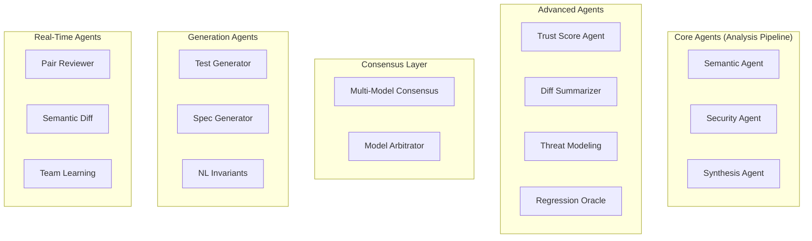

## Base Agent Architecture

All agents inherit from `BaseAgent`, which provides common functionality:

```python
class BaseAgent(ABC):
    """Abstract base class for all AI agents."""
    
    def __init__(self, config: AgentConfig | None = None):
        self.config = config or AgentConfig()
        self._provider = self._init_provider()
    
    @abstractmethod
    async def analyze(self, code: str, **kwargs) -> AgentResult:
        """Main analysis method - must be implemented by subclasses."""
        pass
    
    async def _call_llm(self, prompt: str, **kwargs) -> str:
        """Call the configured LLM provider."""
        if self.config.provider == "openai":
            return await self._call_openai(prompt, **kwargs)
        elif self.config.provider == "anthropic":
            return await self._call_anthropic(prompt, **kwargs)
```

### Configuration

```python
@dataclass
class AgentConfig:
    """Configuration for AI agents."""
    
    provider: str = "openai"  # openai, anthropic
    model: str = "gpt-4"
    temperature: float = 0.1
    max_tokens: int = 4096
    timeout_seconds: int = 60
    retry_attempts: int = 3
    api_key: str | None = None  # Falls back to env var
```

### Result Structure

```python
@dataclass
class AgentResult:
    """Standardized result from any agent."""
    
    success: bool
    data: dict[str, Any]
    error: str | None = None
    tokens_used: int = 0
    latency_ms: int = 0
    model_used: str = ""
```

## Core Agents

### Semantic Agent

**Purpose:** Understand code intent and extract implicit contracts.

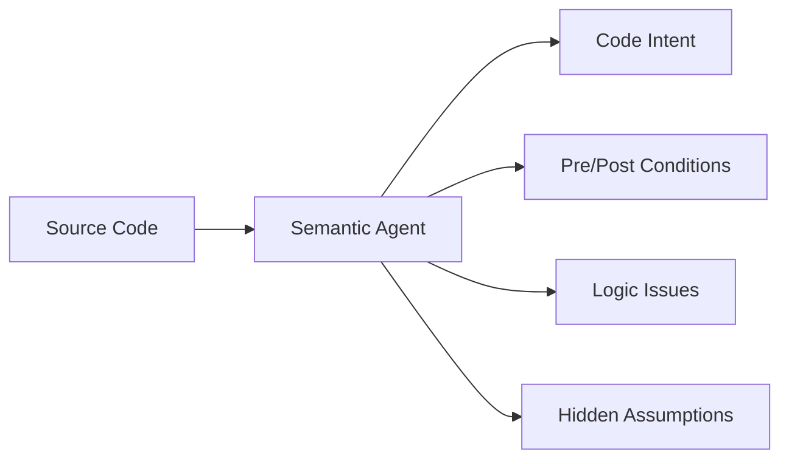

**Key Outputs:**
- Code intent description
- Preconditions (what must be true before execution)
- Postconditions (what will be true after execution)
- Invariants (what remains true throughout)
- Potential logic issues

**Prompt Strategy:**
```
You are a code analysis expert. Analyze this code and extract:
1. The high-level intent and purpose
2. Implicit preconditions (assumptions about inputs)
3. Postconditions (guarantees about outputs)
4. Any logical issues or edge cases

Code:
{code}

Context: {context}
```

### Security Agent

**Purpose:** Detect security vulnerabilities and weaknesses.

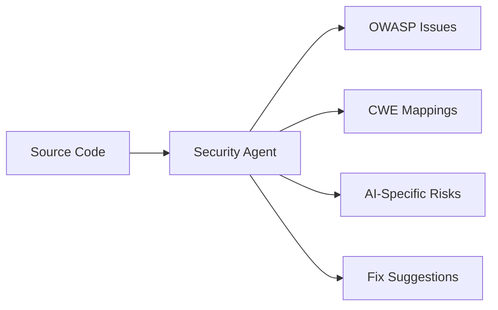

**Detection Categories:**
- OWASP Top 10 2021 vulnerabilities
- Common Weakness Enumeration (CWE) patterns
- AI-generated code risks (prompt injection, data leakage)
- Language-specific security issues

**Output Structure:**
```python
@dataclass
class SecurityFinding:
    title: str
    severity: Severity
    owasp_category: str | None  # e.g., "A03:2021-Injection"
    cwe_id: int | None  # e.g., 89 for SQL Injection
    description: str
    file_path: str
    line_start: int
    line_end: int
    evidence: str
    fix_suggestion: str
    references: list[str]
```

### Synthesis Agent

**Purpose:** Consolidate findings from all sources and generate actionable output.

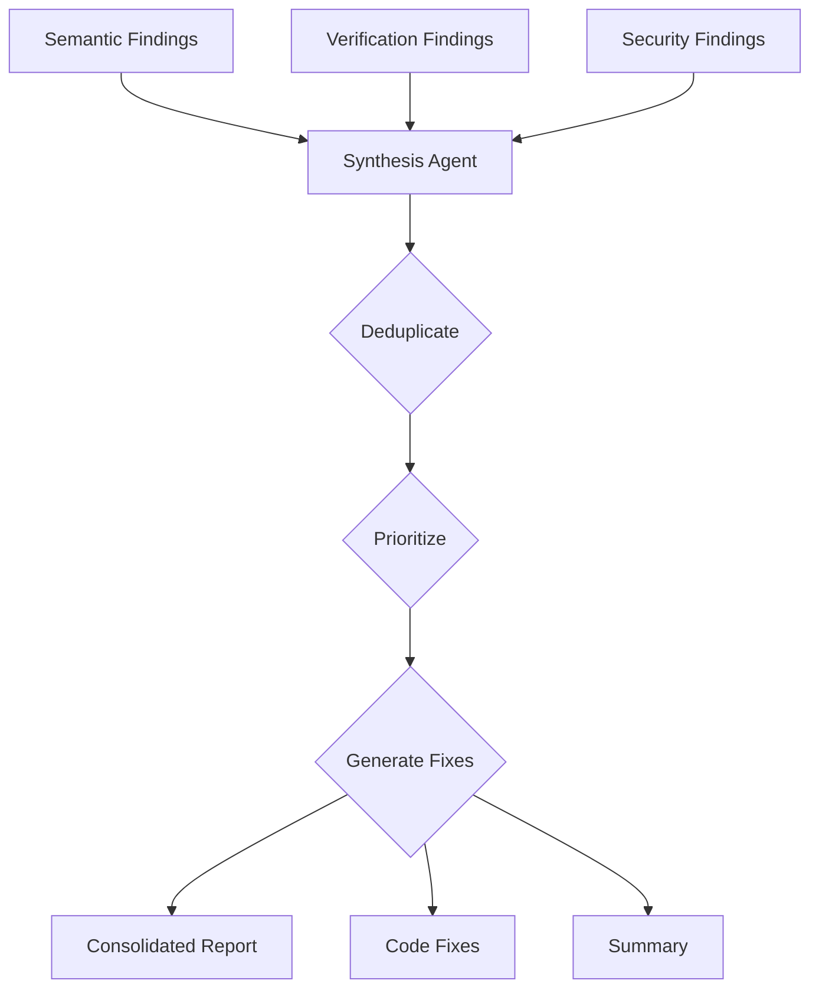

**Responsibilities:**
1. **Deduplication:** Identify when multiple agents found the same issue
2. **Prioritization:** Rank findings by severity and confidence
3. **Fix Generation:** Create concrete code fixes
4. **Summarization:** Generate human-readable summaries

## Advanced Agents

### Trust Score Agent

**Purpose:** Assess the trustworthiness of AI-generated code.

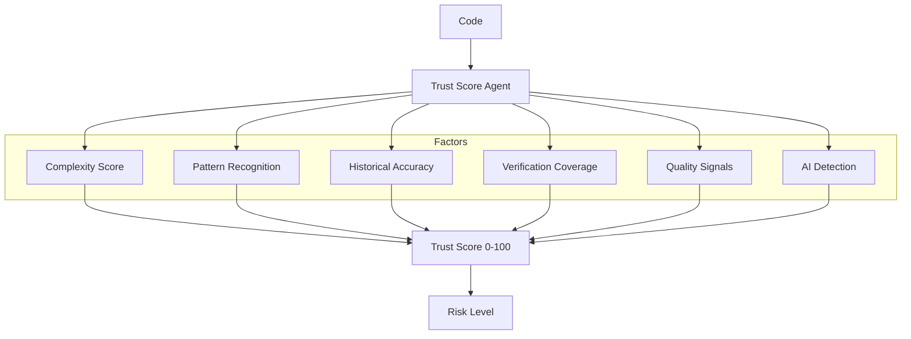

**Scoring Factors:**
| Factor | Weight | Description |
|--------|--------|-------------|
| Complexity | 20% | Cyclomatic complexity, cognitive load |
| Patterns | 15% | Known good/bad code patterns |
| History | 15% | Author's historical accuracy |
| Verification | 30% | Z3 verification coverage |
| Quality | 20% | Linting, type coverage, docs |

### Multi-Model Consensus

**Purpose:** Reduce false positives by querying multiple LLMs.

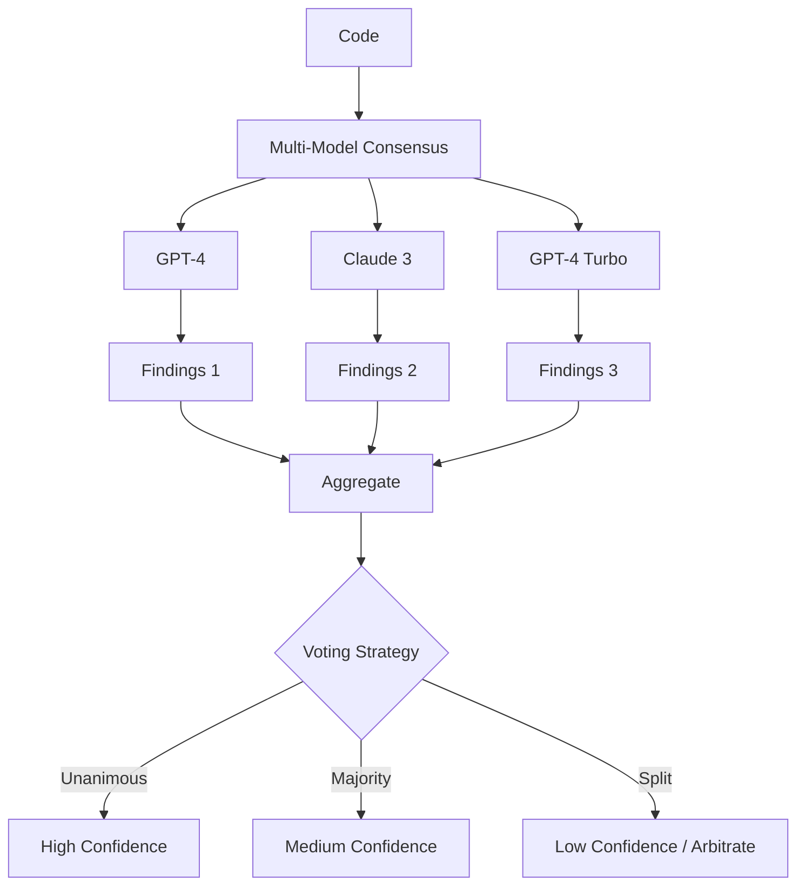

**Voting Strategies:**
```python
class VotingStrategy(Enum):
    UNANIMOUS = "unanimous"      # All models must agree
    MAJORITY = "majority"        # >50% agreement
    WEIGHTED = "weighted"        # Confidence-weighted voting
    ANY = "any"                  # Any model finding is valid
```

### Competing Model Arbitrator

**Purpose:** Resolve disagreements between models through structured debate.

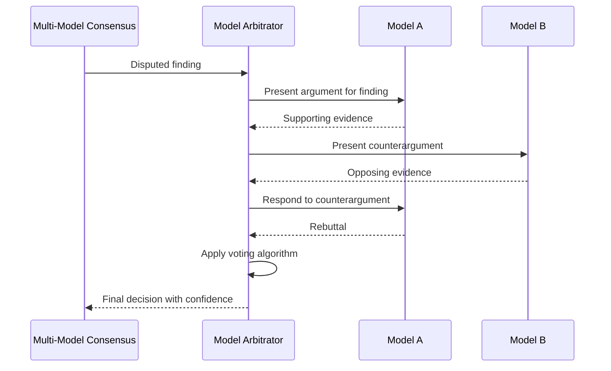

**Voting Algorithms:**
- **Borda Count:** Points based on ranking
- **Approval Voting:** Binary approve/reject
- **Ranked Choice:** Elimination rounds

## Generation Agents

### Test Generator Agent

**Purpose:** Generate tests from Z3 counterexamples.

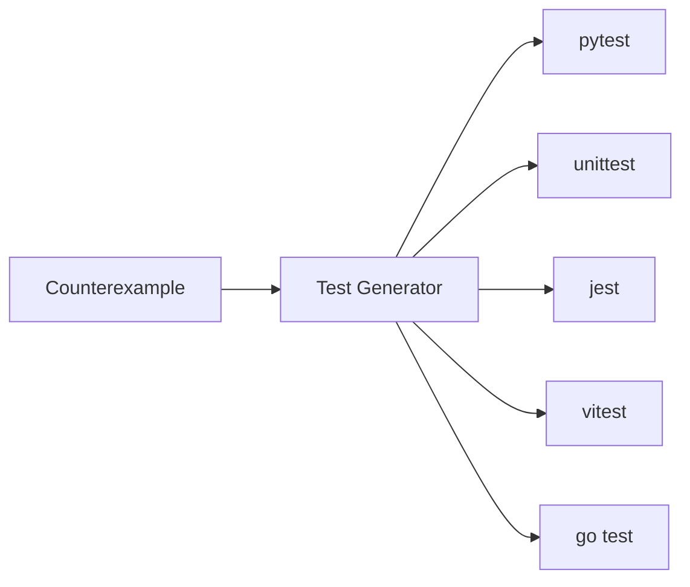

**Example Transformation:**
```python
# Counterexample from Z3:
# {"function": "divide", "inputs": {"a": 10, "b": 0}}

# Generated pytest:
def test_divide_division_by_zero():
    """Test case generated from verification counterexample."""
    with pytest.raises(ZeroDivisionError):
        divide(10, 0)
```

### Natural Language Invariants Agent

**Purpose:** Compile English specifications to Z3 assertions.

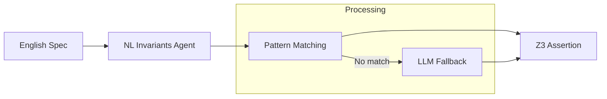

**Pattern Examples:**
| Natural Language | Z3 Output |
|-----------------|-----------|
| "x must be positive" | `x > 0` |
| "balance is non-negative" | `balance >= 0` |
| "index is within bounds" | `And(index >= 0, index < length)` |
| "result is the sum of a and b" | `result == a + b` |

### Specification Generator Agent

**Purpose:** Auto-generate formal specifications from code.

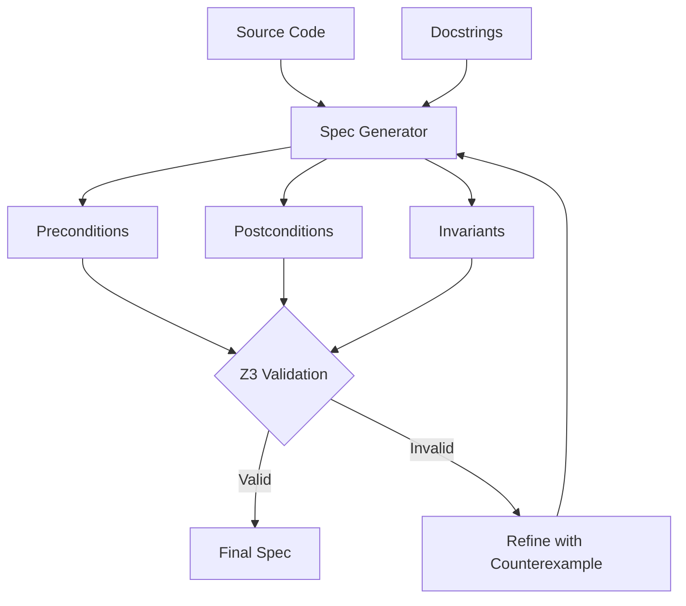

## Real-Time Agents

### Pair Reviewer Agent

**Purpose:** Provide real-time code review as developers type.

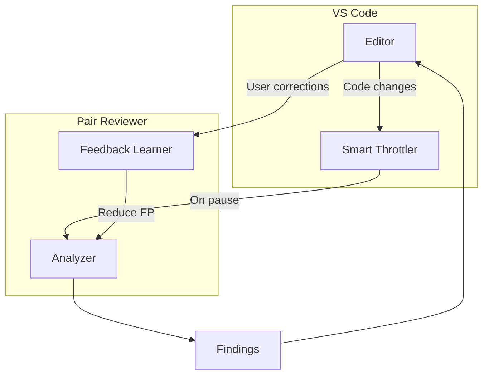

**Throttling Strategy:**
- Don't analyze on every keystroke
- Trigger analysis on 500ms pause
- Cache recent findings
- Learn from user dismissals

### Semantic Diff Agent

**Purpose:** Visualize behavioral changes between code versions.

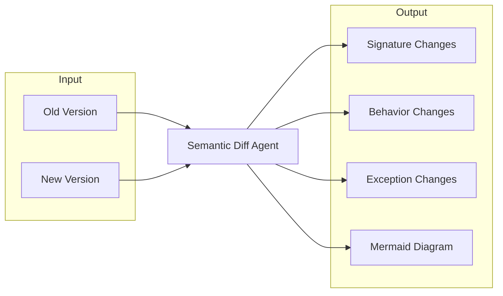

## Agent Communication

Agents communicate through a standardized message protocol:

```python
@dataclass
class AgentMessage:
    """Message passed between agents."""
    
    sender: str  # Agent ID
    receiver: str | None  # None = broadcast
    type: MessageType
    payload: dict[str, Any]
    correlation_id: str  # For tracking
    timestamp: datetime
```

### Pipeline Orchestration

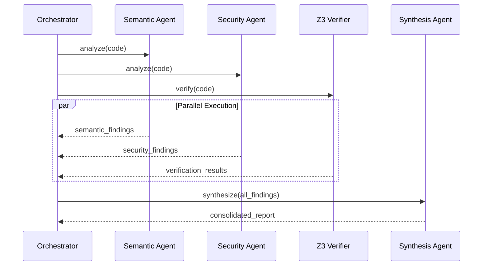

## Extending the Agent System

### Creating a Custom Agent

```python
from codeverify_agents.base import BaseAgent, AgentConfig, AgentResult

class MyCustomAgent(BaseAgent):
    """Custom agent for specialized analysis."""
    
    def __init__(self, config: AgentConfig | None = None):
        super().__init__(config)
        self.system_prompt = "You are a specialized code analyst..."
    
    async def analyze(
        self,
        code: str,
        context: str = "",
        **kwargs
    ) -> AgentResult:
        prompt = self._build_prompt(code, context)
        
        try:
            response = await self._call_llm(prompt)
            findings = self._parse_response(response)
            
            return AgentResult(
                success=True,
                data={"findings": findings},
                tokens_used=self._last_token_count,
                latency_ms=self._last_latency,
                model_used=self.config.model,
            )
        except Exception as e:
            return AgentResult(
                success=False,
                data={},
                error=str(e),
            )
    
    def _build_prompt(self, code: str, context: str) -> str:
        return f"""
{self.system_prompt}

Context: {context}

Code to analyze:
```
{code}
```

Provide your analysis in JSON format.
"""
    
    def _parse_response(self, response: str) -> list[dict]:
        # Parse LLM response into structured findings
        ...
```

### Registering an Agent

```python
from codeverify_agents import AgentRegistry

registry = AgentRegistry()

# Register custom agent
registry.register("my_custom", MyCustomAgent)

# Use in pipeline
agent = registry.get("my_custom", config=my_config)
result = await agent.analyze(code)
```

## Performance Considerations

### Token Optimization

```python
# Use code chunking for large files
async def analyze_large_file(self, code: str) -> AgentResult:
    chunks = self._chunk_code(code, max_tokens=2000)
    results = []
    
    for chunk in chunks:
        result = await self._analyze_chunk(chunk)
        results.append(result)
    
    return self._merge_results(results)
```

### Caching

```python
# Cache expensive operations
from functools import lru_cache

@lru_cache(maxsize=1000)
def _extract_intent(self, code_hash: str) -> str:
    # Expensive LLM call
    ...
```

### Parallel Execution

```python
# Run multiple agents in parallel
async def run_pipeline(code: str) -> dict:
    results = await asyncio.gather(
        semantic_agent.analyze(code),
        security_agent.analyze(code),
        trust_score_agent.calculate_score(code),
        return_exceptions=True,
    )
    return {
        "semantic": results[0],
        "security": results[1],
        "trust_score": results[2],
    }
```

## Monitoring and Observability

### Metrics

| Metric | Description |
|--------|-------------|
| `agent_latency_ms` | Time to complete analysis |
| `agent_tokens_used` | LLM tokens consumed |
| `agent_success_rate` | % of successful analyses |
| `agent_finding_count` | Findings per analysis |
| `consensus_agreement_rate` | % agreement in multi-model |

### Logging

```python
import structlog

logger = structlog.get_logger()

async def analyze(self, code: str) -> AgentResult:
    logger.info(
        "agent_analysis_started",
        agent=self.__class__.__name__,
        code_length=len(code),
    )
    
    result = await self._do_analysis(code)
    
    logger.info(
        "agent_analysis_completed",
        agent=self.__class__.__name__,
        success=result.success,
        findings_count=len(result.data.get("findings", [])),
        latency_ms=result.latency_ms,
    )
    
    return result
```
