# CodeVerify Data Flow

This document describes how data flows through the CodeVerify system during code analysis.

## Overview

CodeVerify processes code through a multi-stage pipeline that combines AI semantic analysis with formal verification using the Z3 SMT solver.

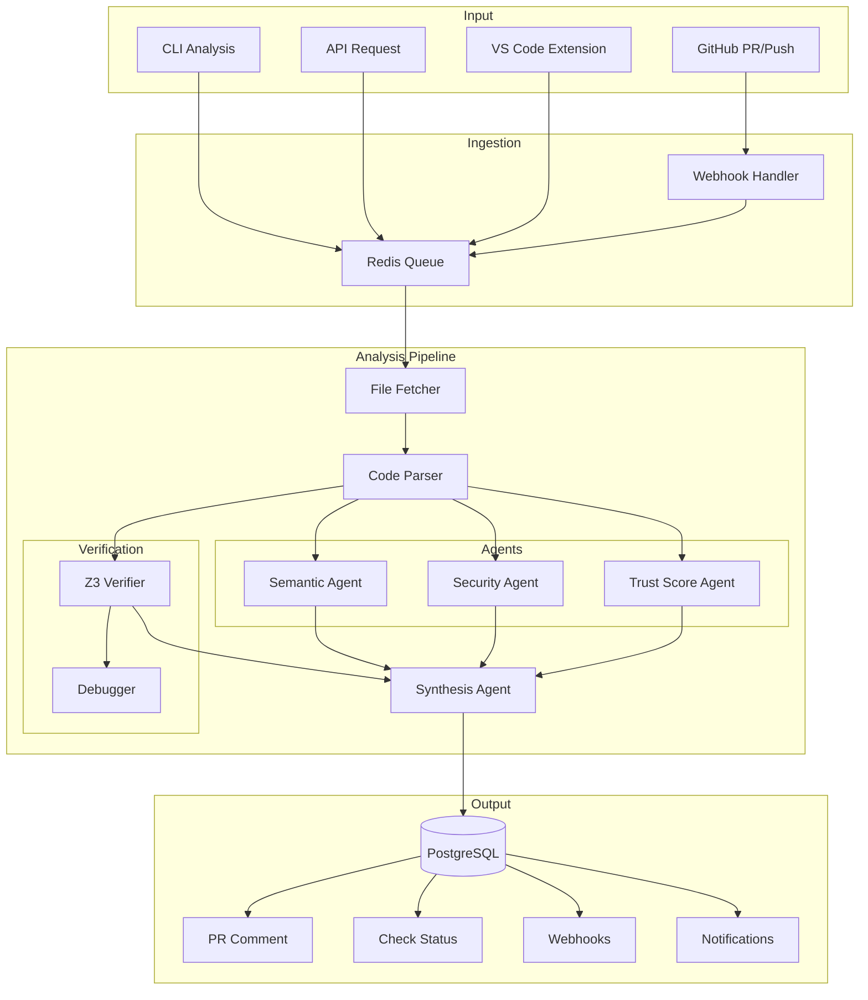

## Stage Details

### 1. Ingestion Layer

#### GitHub Webhook Handler
When a PR is created or updated:

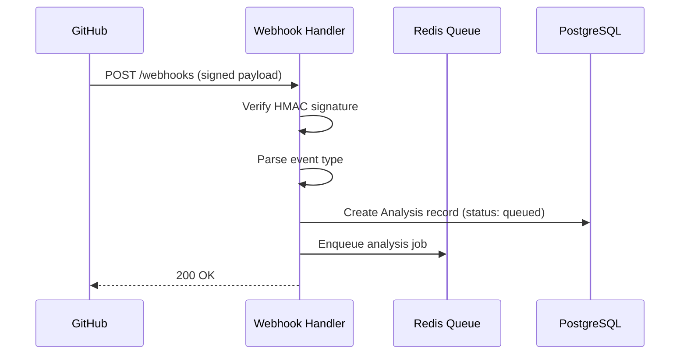

**Job Payload Structure:**
```json
{
  "job_id": "uuid",
  "type": "pr_analysis",
  "repo": "owner/repo",
  "pr_number": 42,
  "base_sha": "abc123",
  "head_sha": "def456",
  "installation_id": 12345,
  "config": {
    "languages": ["python", "typescript"],
    "checks": ["null_safety", "array_bounds"]
  }
}
```

### 2. Analysis Pipeline

The worker processes jobs through multiple stages:

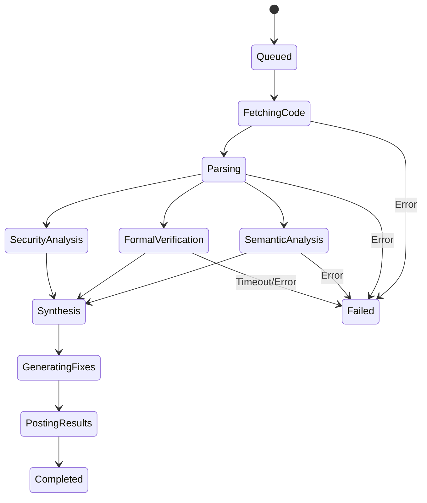

#### 2.1 Code Fetching

```python
# Fetch changed files from GitHub API
files = await github_client.get_pr_files(pr_number)
for file in files:
    content = await github_client.get_file_content(file.path, head_sha)
    diff = await github_client.get_file_diff(file.path, base_sha, head_sha)
```

#### 2.2 Parsing

The parser extracts AST information for each supported language:

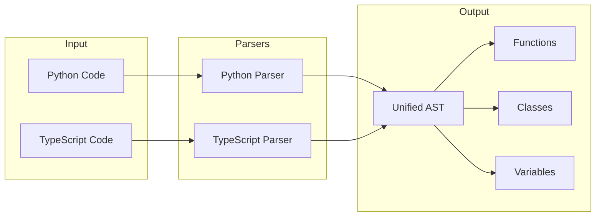

**Parsed Function Structure:**
```python
@dataclass
class ParsedFunction:
    name: str
    parameters: list[Parameter]
    return_type: str | None
    body_ast: ast.AST
    docstring: str | None
    decorators: list[str]
    line_start: int
    line_end: int
```

#### 2.3 Parallel Analysis

Three analysis streams run concurrently:

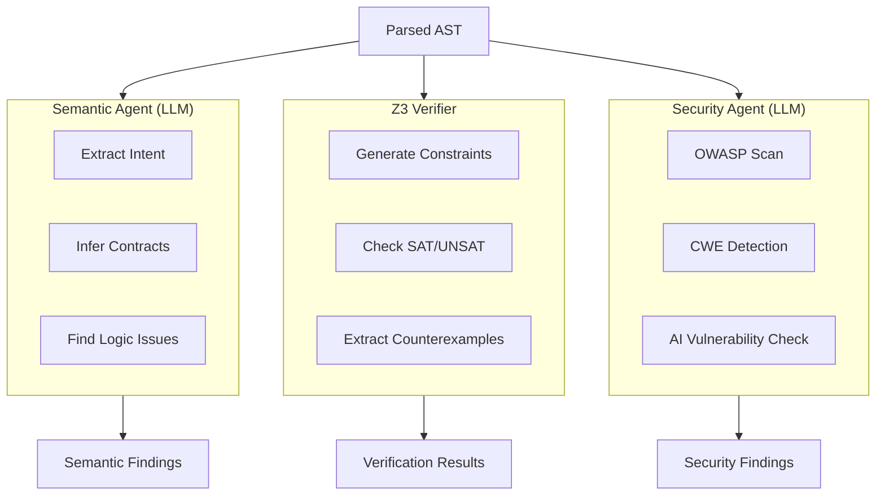

### 3. Z3 Verification Flow

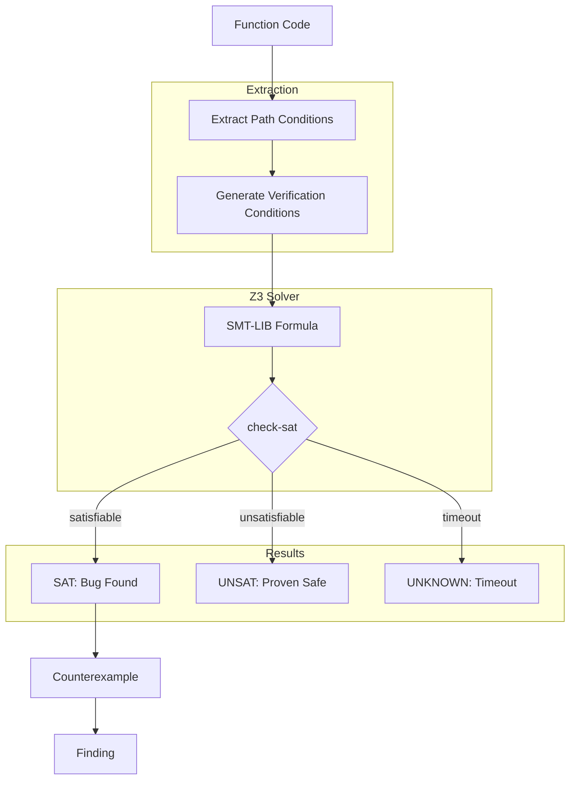

**Verification Condition Example (Division by Zero):**
```smt2
; SMT-LIB formula for: def divide(a, b): return a / b
(declare-const a Int)
(declare-const b Int)
(assert (= b 0))  ; Check if b can be zero
(check-sat)
; Result: sat → Division by zero possible
; Model: b = 0
```

### 4. Synthesis and Output

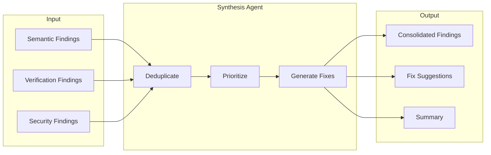

**Final Finding Structure:**
```python
@dataclass
class Finding:
    id: str
    category: FindingCategory  # security, verification, quality
    severity: Severity  # critical, high, medium, low
    title: str
    description: str
    file_path: str
    line_start: int
    line_end: int
    confidence: float  # 0.0-1.0
    source: str  # semantic, z3, security
    fix_suggestion: str | None
    verification_proof: str | None  # Z3 proof for verified findings
```

### 5. Result Delivery

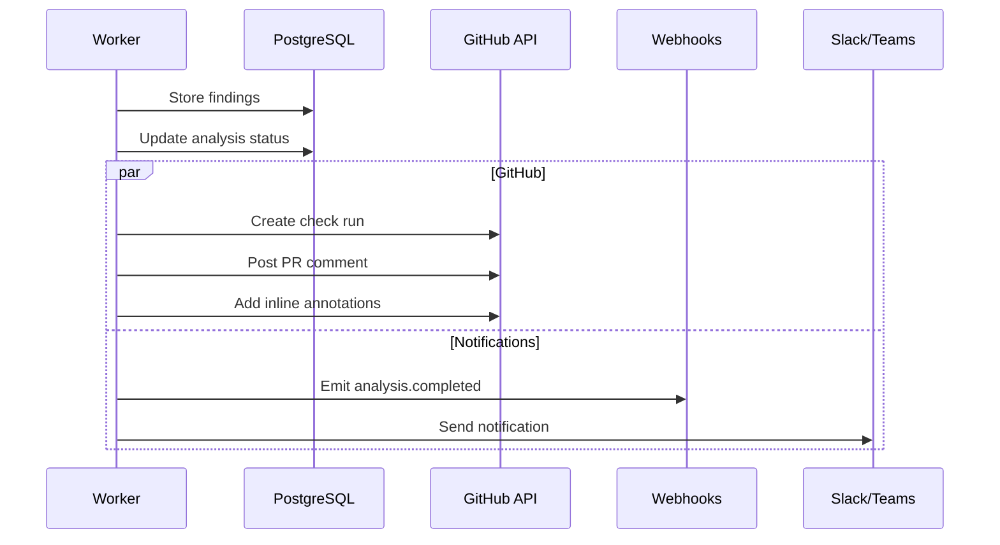

## Caching Strategy

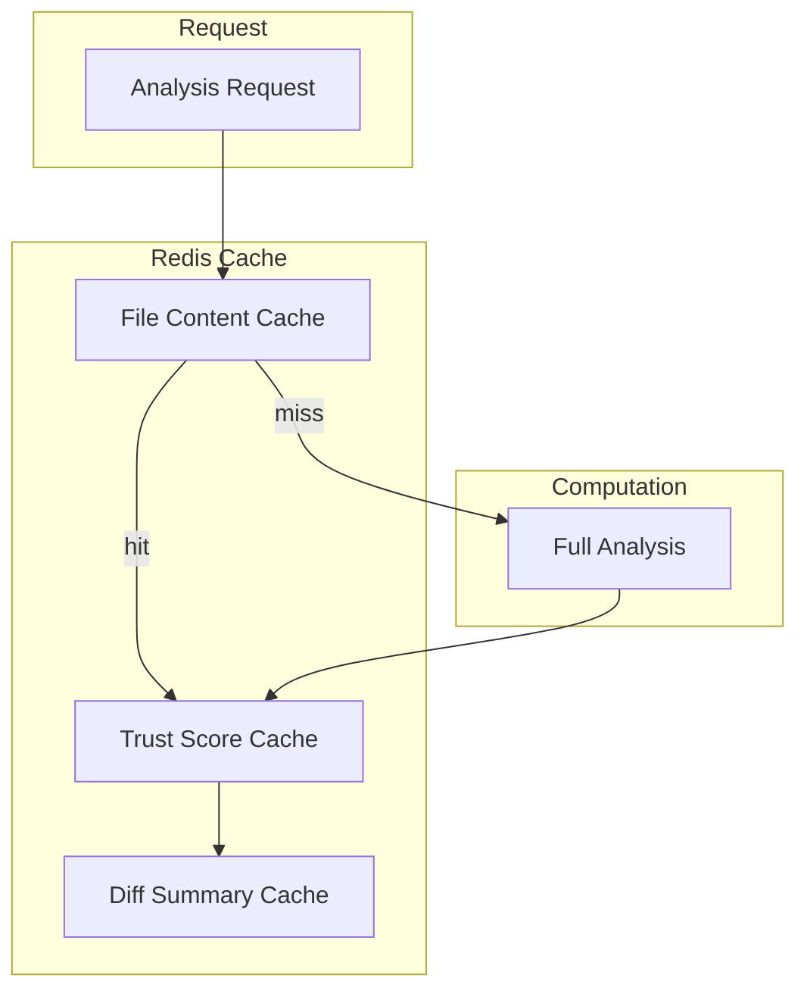

**Cache Keys:**
- `file:{repo}:{sha}:{path}` - File content (TTL: 1 hour)
- `trust:{repo}:{sha}:{path}` - Trust scores (TTL: 24 hours)
- `diff:{repo}:{base}:{head}` - Diff summaries (TTL: 1 hour)

## Error Handling

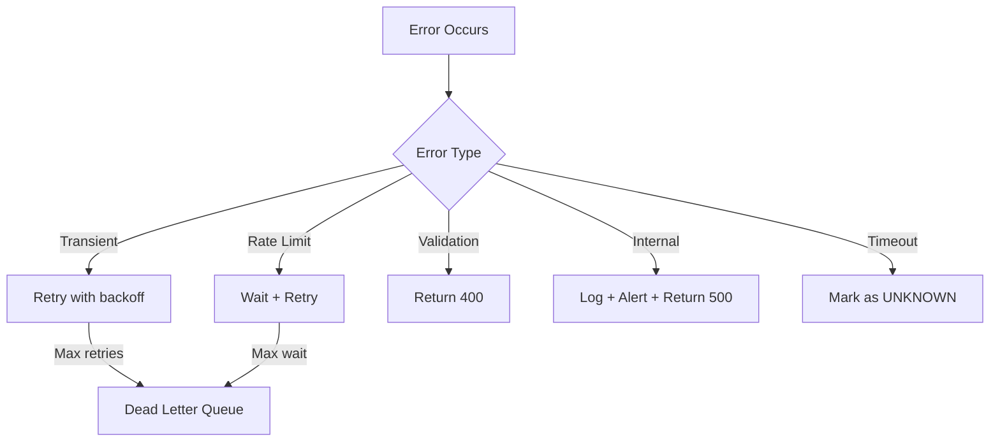

## Performance Characteristics

| Stage | Typical Duration | Parallelism |
|-------|-----------------|-------------|
| Code Fetch | 100-500ms | Per file |
| Parsing | 10-50ms/file | Per file |
| Semantic Agent | 2-5s | Per function |
| Z3 Verification | 100ms-30s | Per check |
| Security Agent | 1-3s | Per file |
| Synthesis | 500ms-2s | Single |
| Result Posting | 200-500ms | Single |

## Scalability

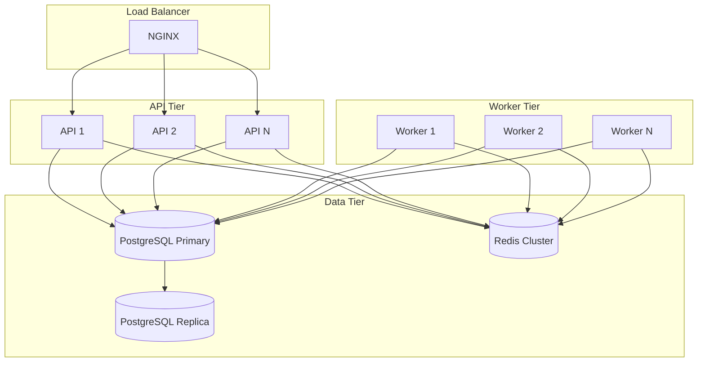

Workers scale horizontally based on queue depth. Each worker can process multiple jobs concurrently using Celery's prefetch settings.
