# CodeVerify Architecture Overview

## System Architecture

CodeVerify is a multi-service application that combines AI-powered code analysis with formal verification to provide comprehensive code review capabilities.

```mermaid
flowchart TB
    subgraph Clients["🖥️ Clients"]
        GH[GitHub<br/>PR Webhooks]
        CLI[CLI Tool]
        IDE[VS Code<br/>Extension]
        API_Client[API Clients]
    end

    subgraph Gateway["🔗 Ingestion Layer"]
        GHA[GitHub App<br/>Node.js/Express]
        Q[(Redis Queue)]
    end

    subgraph Workers["⚙️ Analysis Workers"]
        direction TB
        W[Celery Worker]
        
        subgraph Pipeline["Analysis Pipeline"]
            direction LR
            Parse[Parse Code]
            
            subgraph Agents["AI Agents"]
                SA[Semantic<br/>GPT-4/Claude]
                SC[Security<br/>OWASP/CWE]
            end
            
            Z3[Z3 Verifier<br/>Formal Proofs]
            Synth[Synthesis<br/>Agent]
        end
    end

    subgraph API["⚡ API Service"]
        FastAPI[FastAPI<br/>REST API]
        Auth[Auth<br/>JWT/OAuth]
    end

    subgraph Web["🌐 Web Dashboard"]
        Next[Next.js<br/>React/Tailwind]
    end

    subgraph Data["💾 Data Layer"]
        PG[(PostgreSQL<br/>Persistent)]
        Redis[(Redis<br/>Cache)]
    end

    subgraph External["🌍 External Services"]
        OpenAI[OpenAI API]
        Anthropic[Anthropic API]
        GitHubAPI[GitHub API]
    end

    GH --> GHA
    CLI --> Q
    IDE --> Q
    GHA --> Q
    Q --> W
    W --> Parse
    Parse --> Agents
    Parse --> Z3
    Agents --> Synth
    Z3 --> Synth
    Synth --> PG
    
    API_Client --> FastAPI
    FastAPI --> Auth
    FastAPI --> PG
    FastAPI --> Redis
    
    Next --> FastAPI
    
    Agents --> OpenAI
    Agents --> Anthropic
    GHA --> GitHubAPI
    W --> GitHubAPI
```

## Component Details

### 1. GitHub App Service (`apps/github-app`)

**Technology:** Node.js, Express, Octokit

**Responsibilities:**
- Receive and validate GitHub webhooks
- Queue analysis jobs to Redis
- Post PR comments and check statuses
- Handle app installation events

### 2. API Service (`apps/api`)

**Technology:** Python, FastAPI, SQLAlchemy

**Responsibilities:**
- REST API for the web dashboard
- Authentication via GitHub OAuth
- Analysis results retrieval
- Organization/repository management

### 3. Analysis Worker (`apps/worker`)

**Technology:** Python, Celery, Z3

**Responsibilities:**
- Execute multi-stage analysis pipeline
- Coordinate AI agents
- Run formal verification
- Store results in database

### 4. Web Dashboard (`apps/web`)

**Technology:** Next.js, React, Tailwind CSS

**Responsibilities:**
- Team analytics dashboard
- Analysis result viewing
- Configuration management
- User authentication

## Packages

### `packages/core`

Shared data models and utilities used across all Python services.

### `packages/verifier`

Z3 SMT solver integration for formal verification:
- Integer overflow checking
- Array bounds verification
- Null dereference detection
- Division by zero checking

### `packages/ai-agents`

LLM-powered analysis agents:
- **Semantic Agent:** Understands code intent and extracts contracts
- **Security Agent:** Finds vulnerabilities and security issues
- **Synthesis Agent:** Consolidates results and generates fixes

### `packages/z3-mcp`

Model Context Protocol server for Z3, allowing AI agents to use the SMT solver as a tool.

## Data Flow

### Step-by-Step Flow

1. **PR Created/Updated**
   - GitHub sends webhook to GitHub App service
   - Webhook handler validates HMAC signature
   - Analysis job queued to Redis

2. **Analysis Execution**
   - Worker picks up job from queue
   - Fetches PR diff from GitHub API
   - Runs multi-stage analysis pipeline:
     - Parse code to AST
     - Semantic analysis (LLM)
     - Formal verification (Z3)
     - Security analysis (LLM)
     - Synthesis and fix generation

3. **Results Delivery**
   - Findings stored in PostgreSQL
   - PR comment posted via GitHub API
   - Check status updated
   - Dashboard updated via API

## Security Considerations

- **Code Privacy:** Source code is processed in memory and not persisted
- **Authentication:** GitHub OAuth for users, JWT for API
- **Webhook Security:** HMAC signature verification
- **Data Encryption:** TLS for transit, AES-256 for rest

## Technology Stack

| Layer | Technology | Purpose |
|-------|------------|---------|
| **API** | FastAPI, SQLAlchemy | REST API, ORM |
| **Worker** | Celery, tree-sitter | Job queue, parsing |
| **Verification** | Z3 SMT Solver | Formal proofs |
| **AI** | OpenAI, Anthropic | LLM analysis |
| **Dashboard** | Next.js, React | Web UI |
| **GitHub Integration** | Express, Octokit | Webhooks |
| **Database** | PostgreSQL | Persistence |
| **Cache/Queue** | Redis | Jobs, caching |
