# @codeverify/core

Shared models, utilities, and core functionality for CodeVerify.

[](https://pypi.org/project/codeverify-core/)
[](https://www.python.org/)

## Installation

```bash
pip install codeverify-core

# Or from source
pip install -e packages/core
```

## Overview

This package provides the foundational components used across all CodeVerify services:

- **Models**: Pydantic data models for analyses, findings, rules
- **Configuration**: `.codeverify.yml` parsing and validation
- **Rules Engine**: Custom rule definition and evaluation
- **Notifications**: Slack/Teams integration
- **VCS Abstraction**: Multi-provider version control support
- **Advanced Features**: Monorepo support, budget optimization, proof attestations

## Architecture

```mermaid
graph TB
    subgraph Core["codeverify-core"]
        Models["📦 Models<br/>Analysis, Finding, Repository"]
        Config["⚙️ Config<br/>.codeverify.yml parser"]
        Rules["📋 Rules Engine<br/>Pattern, AST, Semantic"]
        VCS["🔗 VCS Abstraction<br/>GitHub, GitLab, Bitbucket"]
        Notifications["🔔 Notifications<br/>Slack, Teams"]
        
        subgraph Advanced["Advanced Features"]
            Monorepo["📁 Monorepo<br/>Package discovery"]
            Budget["💰 Budget<br/>Cost optimization"]
            Proof["🔐 Proof<br/>Attestations"]
            Ramp["📈 Gradual Ramp<br/>Enforcement"]
        end
    end
    
    API[apps/api] --> Core
    Worker[apps/worker] --> Core
    CLI[packages/cli] --> Core
    Agents[packages/ai-agents] --> Core
    Verifier[packages/verifier] --> Core
```



## Modules

### `models`

Core data models:

```python
from codeverify_core.models import (
    Analysis,
    Finding,
    Repository,
    Organization,
    Severity,
)

finding = Finding(
    title="Potential null dereference",
    severity=Severity.HIGH,
    category="verification",
    file_path="src/utils.py",
    line_start=42,
    confidence=0.95,
)
```

### `config`

Configuration management:

```python
from codeverify_core.config import CodeVerifyConfig

config = CodeVerifyConfig.from_file(".codeverify.yml")
print(config.languages)  # ['python', 'typescript']
print(config.thresholds.critical)  # 0
```

### `rules`

Custom rule engine:

```python
from codeverify_core.rules import (
    RuleEngine,
    PatternRule,
    RuleResult,
)

engine = RuleEngine()

# Add pattern-based rule
rule = PatternRule(
    id="no-print",
    name="No Print Statements",
    pattern=r"\bprint\s*\(",
    severity="low",
)
engine.add_rule(rule)

# Evaluate
results = engine.evaluate(code, language="python")
```

### `notifications`

Notification integrations:

```python
from codeverify_core.notifications import (
    SlackNotifier,
    TeamsNotifier,
)

slack = SlackNotifier(webhook_url="https://hooks.slack.com/...")
await slack.send_analysis_complete(analysis)

teams = TeamsNotifier(webhook_url="https://outlook.office.com/...")
await teams.send_finding_alert(finding)
```

### `vcs`

Version control abstraction:

```python
from codeverify_core.vcs import VCSFactory, PullRequest

# Auto-detect VCS provider
vcs = VCSFactory.create_from_url("https://github.com/org/repo")

# Get PR details
pr = await vcs.get_pull_request(123)
files = await vcs.get_pr_files(123)
diff = await vcs.get_pr_diff(123)
```

### `monorepo`

Monorepo analysis:

```python
from codeverify_core.monorepo import MonorepoAnalyzer

analyzer = MonorepoAnalyzer("/path/to/repo")
packages = analyzer.discover_packages()
affected = analyzer.get_affected_packages(["packages/core/src/index.ts"])
```

### `budget_optimizer`

Verification cost optimization:

```python
from codeverify_core.budget_optimizer import (
    VerificationBudgetOptimizer,
    Budget,
    RiskFactors,
)

optimizer = VerificationBudgetOptimizer()
decision = optimizer.optimize_file(
    file_path="src/auth.py",
    file_size_lines=200,
    factors=RiskFactors(file_complexity=0.8),
    budget=Budget(tier="standard"),
)
```

### `gradual_ramp`

Gradual enforcement ramp:

```python
from codeverify_core.gradual_ramp import GradualVerificationRamp

ramp = GradualVerificationRamp()
state = ramp.start_ramp("org/repo")
decision = ramp.evaluate_enforcement("org/repo", findings)
```

### `proof_carrying`

Proof attestations:

```python
from codeverify_core.proof_carrying import ProofCarryingManager

manager = ProofCarryingManager(secret_key="...")
proof = manager.create_proof(code_hash="abc123", result="passed")
attestation = manager.sign_proof(proof)
```

## Development

```bash
# Install with dev dependencies
pip install -e "packages/core[dev]"

# Run tests
pytest packages/core/tests -v

# Type checking
mypy packages/core/src

# Linting
ruff check packages/core
```

## API Reference

See the [API documentation](../../docs/api-reference.md) for complete details.
