# Welcome to CodeVerify

**CodeVerify** combines the intelligence of large language models with the rigor of formal verification to catch bugs that traditional static analysis misses—especially important for AI-generated code.

## Why CodeVerify?

Modern development increasingly relies on AI coding assistants like GitHub Copilot. While these tools boost productivity, they can introduce subtle bugs that are easy to miss in code review:

- **Null pointer dereferences** that slip past type systems
- **Off-by-one errors** in array access
- **Integer overflow** in arithmetic operations
- **Division by zero** from unchecked inputs
- **Security vulnerabilities** from improper validation

CodeVerify catches these issues before they reach production by combining:

🔬 **Formal Verification** — Z3 SMT solver provides mathematical proofs of correctness  
🤖 **AI Analysis** — LLM agents understand code intent and detect security issues  
🎯 **Trust Scores** — ML-powered assessment of AI-generated code quality

## Quick Start

Get started in under 5 minutes:

```bash
# Install CodeVerify
pip install codeverify

# Analyze a file
codeverify analyze src/main.py

# Or install the GitHub App for automatic PR analysis
# Visit: https://github.com/apps/codeverify
```

## Core Features

| Feature | Description |
|---------|-------------|
| **Formal Verification** | Z3 SMT solver proves null safety, bounds, overflow, division-by-zero |
| **AI Semantic Analysis** | LLM-powered understanding of code intent and logic |
| **Security Scanning** | OWASP Top 10 and common vulnerability patterns |
| **GitHub Integration** | Automatic PR checks, inline comments, suggested fixes |
| **Copilot Trust Score** | Real-time assessment of AI-generated code quality |
| **VS Code Extension** | Verification as you code with Copilot interception |
| **Team Dashboard** | Organization-wide metrics, trends, and learning |

## How It Works

```mermaid
flowchart LR
    subgraph Input["📥 Input"]
        PR[GitHub PR]
    end
    
    subgraph Analysis["⚡ Analysis Pipeline"]
        direction TB
        Semantic["🤖 Semantic<br/>Agent"]
        Formal["🔬 Formal<br/>Verifier"]
        Security["🛡️ Security<br/>Agent"]
        Synth["🧬 Synthesis"]
        
        Semantic --> Synth
        Formal --> Synth
        Security --> Synth
    end
    
    subgraph Output["📤 Output"]
        Comment[PR Comment]
        Check[GitHub Check]
    end
    
    PR --> Analysis
    Synth --> Comment
    Synth --> Check
    
    style Formal fill:#4338ca,color:#fff
    style Semantic fill:#7c3aed,color:#fff  
    style Security fill:#dc2626,color:#fff
```



1. **PR Created** → GitHub webhook triggers analysis
2. **Code Parsed** → AST extraction for each changed file
3. **Parallel Analysis** → Semantic, formal, and security agents run concurrently
4. **Synthesis** → Results combined, duplicates removed, fixes suggested
5. **Results Delivered** → PR comment, inline annotations, check status

## Supported Languages

| Language | Formal Verification | AI Analysis | Status |
|----------|---------------------|-------------|--------|
| Python | ✅ Full | ✅ Full | Stable |
| TypeScript/JavaScript | ✅ Full | ✅ Full | Stable |
| Go | 🚧 Partial | ✅ Full | Beta |
| Java | 🔜 Planned | 🔜 Planned | Roadmap |

## Next Steps

- **[Quick Start](/docs/getting-started/quick-start)** - Get CodeVerify running in 5 minutes
- **[Core Concepts](/docs/concepts/how-it-works)** - Understand how CodeVerify works
- **[Configuration](/docs/configuration/overview)** - Customize for your project
- **[GitHub Integration](/docs/integrations/github)** - Set up automatic PR checks
