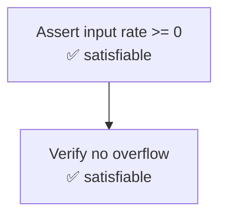

# Interactive Proof Explorer

Visualize and step through formal verification proofs.

## Overview

The Proof Explorer makes Z3 verification results accessible to developers who aren't formal methods experts. It serializes proof traces into navigable steps and exports them as Mermaid diagrams or interactive JSON for embedding in PRs and dashboards.

## Features

- **Step-through navigation** — Walk through proof steps one at a time
- **Mermaid diagram export** — Visualize proof trees in documentation and PRs
- **JSON serialization** — Machine-readable proof format for CI integration
- **Proof annotation** — Add human-readable labels to proof steps

## Usage

```python
from codeverify_core.proof_explorer import ProofExplorer, ProofTrace, ProofStep

# Build a proof trace
trace = ProofTrace(
    function_name="calculate_tax",
    file_path="src/billing.py",
    steps=[
        ProofStep(
            id="s1",
            description="Assert input rate >= 0",
            constraint="rate >= 0",
            result="satisfiable",
        ),
        ProofStep(
            id="s2",
            description="Verify no overflow in multiplication",
            constraint="amount * rate < INT_MAX",
            result="satisfiable",
            depends_on=["s1"],
        ),
    ],
)

explorer = ProofExplorer()
explorer.add_trace(trace)

# Export as Mermaid diagram
mermaid = explorer.to_mermaid(trace)
print(mermaid)
```

### Mermaid Output



## Step-Through Navigation

```python
# Navigate proof steps
explorer.goto_step(0)
current = explorer.current_step()
print(f"Step: {current.description}")
print(f"Constraint: {current.constraint}")
print(f"Result: {current.result}")

explorer.next_step()
```

## JSON Export

```python
# Export for CI artifacts
proof_json = explorer.to_json(trace)

# Attach to GitHub Check Run
import json
with open("proof-trace.json", "w") as f:
    json.dump(proof_json, f, indent=2)
```

:::note
Proof traces are automatically captured during formal verification when running through the worker pipeline. They appear in the analysis results and can be viewed in the organization dashboard.
:::
