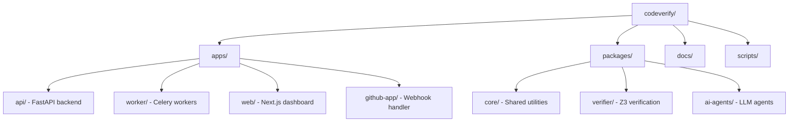

# Contributing

Thank you for your interest in contributing to CodeVerify! This guide covers everything you need to get started.

## Ways to Contribute

| Contribution Type | Good First Issue? | Difficulty |
|-------------------|-------------------|------------|
| Documentation fixes | ✅ Yes | Easy |
| Bug reports | ✅ Yes | Easy |
| Test coverage | ✅ Yes | Easy-Medium |
| Bug fixes | Sometimes | Medium |
| New verification checks | No | Medium-Hard |
| New AI agents | No | Hard |
| Core architecture | No | Hard |

## Quick Start

### 1. Fork and Clone

```bash
git clone https://github.com/YOUR_USERNAME/codeverify.git
cd codeverify
```

### 2. Set Up Development Environment

```bash
# Copy environment template
cp .env.example .env

# Start infrastructure
docker compose up -d postgres redis

# Install Python packages
pip install -e "packages/core[dev]" \
            -e "packages/verifier[dev]" \
            -e "packages/ai-agents[dev]" \
            -e "apps/api[dev]" \
            -e "apps/worker[dev]"

# Install Node.js packages
cd apps/web && npm install && cd ../..
cd apps/github-app && npm install && cd ../..

# Run migrations
cd apps/api && alembic upgrade head && cd ../..

# Validate setup
python scripts/validate_env.py
```

### 3. Run Tests

```bash
# All tests
./scripts/test.sh

# Specific package
pytest packages/verifier/tests -v

# With coverage
pytest --cov=codeverify --cov-report=html
```

## Development Workflow

### Branch Naming

```
feature/add-go-language-support
fix/null-check-false-positive
docs/improve-quickstart
refactor/simplify-z3-constraints
test/add-overflow-edge-cases
```

### Commit Messages

We use [Conventional Commits](https://www.conventionalcommits.org/):

```
type(scope): description

[optional body]

[optional footer]
```

**Types:** `feat`, `fix`, `docs`, `style`, `refactor`, `test`, `chore`

**Examples:**

```bash
git commit -m "feat(verifier): add integer overflow detection"
git commit -m "fix(api): handle null repository in webhook"
git commit -m "docs(readme): update installation instructions"
```

### Pull Request Process

1. **Create a feature branch** from `main`
2. **Make your changes** with clear, atomic commits
3. **Run tests and linting** — PR checks will fail otherwise
4. **Submit a PR** with a clear description using our template
5. **Address review feedback** promptly
6. **Squash and merge** when approved

## Code Style

### Python

- Follow [PEP 8](https://pep8.org/)
- Use type hints for all functions
- Run `ruff check .` for linting
- Run `black .` for formatting

```python
from typing import Optional

def process_analysis(
    analysis_id: str,
    config: Optional[dict] = None,
) -> AnalysisResult:
    """Process an analysis job.
    
    Args:
        analysis_id: Unique identifier for the analysis
        config: Optional configuration overrides
        
    Returns:
        The analysis result with findings
        
    Raises:
        AnalysisError: If processing fails
    """
    ...
```

### TypeScript

- Use TypeScript strict mode
- Use ESLint + Prettier
- Prefer functional components for React

```typescript
interface AnalysisProps {
  analysisId: string;
  onComplete?: (result: AnalysisResult) => void;
}

export function AnalysisView({ analysisId, onComplete }: AnalysisProps) {
  // ...
}
```

## Project Structure



## Adding Features

### New Verification Check

1. Add the check to `packages/verifier/src/codeverify_verifier/z3_verifier.py`
2. Add tests in `packages/verifier/tests/`
3. Update config schema in `packages/core/src/codeverify_core/config.py`
4. Document in verification docs

**Example: Adding a new check**

```python
# packages/verifier/src/codeverify_verifier/checks/my_check.py
from z3 import *

class MyNewCheck:
    """Check for some property."""
    
    def check(self, ast_node: ASTNode) -> list[Finding]:
        # Generate Z3 constraints
        solver = Solver()
        # ... add constraints ...
        
        if solver.check() == sat:
            model = solver.model()
            return [Finding(
                type="my_check",
                severity="high",
                message="Issue found",
                counterexample=str(model),
            )]
        return []
```

### New AI Agent

1. Create agent file in `packages/ai-agents/src/codeverify_agents/`
2. Inherit from `BaseAgent`
3. Implement `analyze()` method
4. Add tests
5. Register in analysis pipeline

**Example: Adding a new agent**

```python
# packages/ai-agents/src/codeverify_agents/my_agent.py
from .base import BaseAgent

class MyNewAgent(BaseAgent):
    """Agent for detecting something."""
    
    system_prompt = """You are a code analysis expert..."""
    
    async def analyze(self, code: str, context: dict) -> list[Finding]:
        response = await self.llm.chat(
            system=self.system_prompt,
            user=f"Analyze this code:\n{code}"
        )
        return self.parse_findings(response)
```

### New API Endpoint

1. Create router in `apps/api/src/codeverify_api/routers/`
2. Add to `main.py`
3. Add tests
4. Update API documentation

## Testing Guidelines

### Test Structure

```python
"""Tests for feature_name."""
import pytest

class TestFeatureName:
    """Tests for FeatureName class."""
    
    @pytest.fixture
    def setup(self):
        """Common test setup."""
        return SomeFixture()
    
    def test_happy_path(self, setup):
        """Test normal operation."""
        result = do_something()
        assert result == expected
    
    def test_edge_case(self, setup):
        """Test edge case handling."""
        with pytest.raises(ExpectedException):
            do_something_invalid()
```

### Coverage Requirements

- New features: **>80%** coverage
- Bug fixes: Include regression test
- Refactors: Maintain existing coverage

### Mocking External Services

```python
@pytest.fixture
def mock_github_api(mocker):
    """Mock GitHub API calls."""
    return mocker.patch(
        'codeverify.github.client.get_pr',
        return_value=mock_pr_data
    )

@pytest.fixture
def mock_llm(mocker):
    """Mock LLM API calls."""
    return mocker.patch(
        'codeverify.ai.llm.chat',
        return_value="AI response"
    )
```

## Reporting Issues

### Bug Reports

Open an issue with:

- **Description** of the issue
- **Steps to reproduce**
- **Expected vs actual behavior**
- **Environment details** (OS, Python version, etc.)
- **Relevant logs or error messages**

### Feature Requests

Open an issue with:

- **Description** of the feature
- **Use case / motivation**
- **Proposed implementation** (if any)
- **Alternatives considered**

## Getting Help

- **GitHub Discussions** — Questions, ideas, show & tell
- **Discord** — Real-time chat with maintainers
- **GitHub Issues** — Bug reports, feature requests

## Recognition

Contributors are recognized in:

- `CONTRIBUTORS.md` file
- Release notes for significant contributions
- Security advisories (for vulnerability reporters)

## License

By contributing, you agree that your contributions will be licensed under the MIT License.

---

**Ready to contribute?** Check out our [good first issues](https://github.com/codeverify/codeverify/labels/good%20first%20issue) to get started!
