# Performance & Benchmarks

CodeVerify is designed for speed without sacrificing accuracy. This page documents our performance characteristics and benchmarks.

## Quick Numbers

| Metric | Value | Notes |
|--------|-------|-------|
| **Cold start** | ~1.8s | First analysis in a session |
| **Incremental analysis** | ~0.8s | Subsequent analyses with cache |
| **Throughput** | ~500 LOC/sec | Lines analyzed per second |
| **Memory (typical)** | ~200MB | For medium-sized projects |
| **Memory (large)** | ~1GB | For projects with 100K+ LOC |

## Benchmark Suite

We maintain a benchmark suite that runs on every release. Results are from a GitHub Actions runner (Ubuntu, 4 vCPUs, 16GB RAM).

### Single File Analysis

Time to analyze a single Python file with all checks enabled:

| File Size | Time | Z3 Constraints |
|-----------|------|----------------|
| 50 LOC | 0.3s | ~20 |
| 200 LOC | 0.8s | ~80 |
| 500 LOC | 1.5s | ~200 |
| 1000 LOC | 2.8s | ~400 |

### PR Analysis (Changed Files Only)

Time to analyze a typical PR with various numbers of changed files:

| Changed Files | Total LOC | Time | Parallel Workers |
|---------------|-----------|------|------------------|
| 5 files | 500 | 2.1s | 4 |
| 20 files | 2,000 | 5.3s | 4 |
| 50 files | 5,000 | 11.2s | 4 |
| 100 files | 10,000 | 18.5s | 4 |

### Full Repository Scan

Time to scan entire repositories of various sizes:

| Repository | Files | LOC | Time | Findings |
|------------|-------|-----|------|----------|
| Small Flask app | 25 | 2,500 | 8s | 12 |
| Medium Django project | 150 | 25,000 | 45s | 67 |
| Large monorepo | 800 | 150,000 | 3m 20s | 234 |

## Z3 Solver Performance

The Z3 SMT solver is the most computationally intensive component. Here's how different verification types perform:

### Verification Type Benchmarks

| Check Type | Avg Time | Complexity |
|------------|----------|------------|
| Null safety | 15ms | Low |
| Division by zero | 12ms | Low |
| Array bounds | 45ms | Medium |
| Integer overflow | 35ms | Medium |
| Combined (all 4) | 85ms | Medium |

### Constraint Complexity

Z3 performance depends on constraint complexity:

```
Simple:     x != 0                    → ~5ms
Moderate:   x > 0 && x < len(arr)     → ~20ms  
Complex:    loop invariants           → ~100ms
Very Complex: nested conditions       → ~500ms
```

### Timeout Handling

CodeVerify sets a 30-second timeout per function for Z3 solving. If Z3 times out:

1. The function is marked with `verification: timeout`
2. AI analysis still runs (no timeout)
3. A warning is included in the report

You can adjust the timeout:

```yaml
verification:
  z3_timeout: 60  # seconds
```

## AI Agent Performance

### LLM Latency

Response times for AI agents (using GPT-4):

| Agent | Avg Latency | P95 Latency | Tokens/Request |
|-------|-------------|-------------|----------------|
| Semantic | 1.2s | 2.5s | ~1,500 |
| Security | 0.8s | 1.8s | ~1,000 |
| Synthesis | 0.5s | 1.2s | ~800 |

### Parallel Execution

All analysis engines run in parallel:

```mermaid
gantt
    title Analysis Timeline (typical 500 LOC file)
    dateFormat X
    axisFormat %Lms
    
    section Parsing
    AST Extraction     :0, 100
    Type Resolution    :100, 200
    
    section Parallel Analysis
    Semantic Agent     :200, 1400
    Z3 Verifier        :200, 700
    Security Agent     :200, 1000
    
    section Synthesis
    Combine Results    :1400, 1600
    Generate Fixes     :1600, 1800
```



Total wall-clock time: **1.8 seconds** (not the sum of individual times).

## Optimization Tips

### 1. Use Incremental Analysis

CodeVerify caches AST and type information. Subsequent analyses of unchanged files are instant:

```bash
# First run: 5.2s
codeverify analyze src/

# Second run (no changes): 0.3s
codeverify analyze src/
```

### 2. Analyze Changed Files Only

In CI, analyze only changed files:

```yaml
- name: Get changed files
  id: changed
  uses: tj-actions/changed-files@v42
  with:
    files: '**/*.{py,ts,tsx}'

- name: Run CodeVerify
  uses: codeverify/action@v1
  with:
    files: ${{ steps.changed.outputs.all_changed_files }}
```

### 3. Disable Unused Checks

If you only need specific checks:

```yaml
verification:
  checks:
    - null_safety
    - division_by_zero
    # Omit array_bounds and integer_overflow for faster analysis
```

### 4. Adjust Z3 Timeout

For faster CI feedback, reduce Z3 timeout:

```yaml
verification:
  z3_timeout: 10  # Faster, may miss complex issues
```

### 5. Use Parallel Workers

Increase parallelism for multi-core systems:

```bash
codeverify analyze src/ --workers 8
```

### 6. Exclude Test Files

Test files often have intentional edge cases:

```yaml
exclude:
  - "tests/**"
  - "**/*.test.py"
  - "**/*.spec.ts"
```

## Memory Usage

### Baseline Requirements

| Component | Memory |
|-----------|--------|
| CodeVerify runtime | 50MB |
| Z3 solver | 100MB |
| Python AST cache | 50MB/10K LOC |
| TypeScript compiler | 150MB |

### Large Project Considerations

For repositories over 50K LOC:

1. **Use streaming analysis** — Analyze files one at a time instead of loading all into memory
2. **Limit parallel workers** — Each worker uses ~200MB
3. **Consider chunked scanning** — Split into multiple CI jobs

```yaml
# Memory-efficient configuration
analysis:
  streaming: true
  workers: 2
  chunk_size: 100  # files per chunk
```

## Comparison with Other Tools

### Static Analysis Speed

| Tool | 10K LOC | 100K LOC | Notes |
|------|---------|----------|-------|
| CodeVerify | 18s | 3m 20s | Full formal verification |
| ESLint | 5s | 45s | Pattern matching only |
| Pylint | 8s | 1m 30s | No formal verification |
| mypy | 12s | 2m | Type checking only |
| Semgrep | 10s | 1m 45s | Pattern matching |

CodeVerify is slower but catches bugs that other tools miss.

### Accuracy vs Speed Trade-off

```
Speed     ←─────────────────────────────────→ Accuracy

ESLint ─────────────────── CodeVerify
         Fast, pattern-only    Thorough, formal proofs
```

## Continuous Monitoring

Track CodeVerify performance in your CI:

```yaml
- name: Run CodeVerify with metrics
  run: |
    codeverify analyze src/ --metrics > metrics.json
    
- name: Upload metrics
  uses: actions/upload-artifact@v4
  with:
    name: codeverify-metrics
    path: metrics.json
```

The metrics file includes:
- Total analysis time
- Time per file
- Z3 constraint counts
- Memory usage
- Cache hit rate

## Reporting Performance Issues

If you experience slow analysis:

1. Run with `--debug` to get timing breakdown
2. Check Z3 constraint counts (high counts = slow)
3. Look for functions with many branches/loops
4. [Open an issue](https://github.com/codeverify/codeverify/issues) with the timing report

```bash
codeverify analyze src/ --debug --timing-report > timing.txt
```
