# Security

CodeVerify takes security seriously. This page covers our security practices and how to report vulnerabilities.

## Reporting Vulnerabilities

:::danger Important
**DO NOT** open a public GitHub issue for security vulnerabilities.
:::

### How to Report

**Option 1: GitHub Security Advisories (Preferred)**

1. Go to [Security Advisories](https://github.com/codeverify/codeverify/security/advisories/new)
2. Create a new private security advisory
3. Include the details listed below

**Option 2: Email**

Send details to: **security@codeverify.dev**

For sensitive information, use our PGP key available at `https://codeverify.dev/.well-known/security.txt`

### What to Include

- **Description**: Clear description of the vulnerability
- **Impact**: What an attacker could achieve
- **Steps to Reproduce**: Detailed steps
- **Affected Versions**: Which versions are affected
- **Suggested Fix**: If you have ideas (optional)

### What to Expect

| Timeline | Action |
|----------|--------|
| 48 hours | We acknowledge receipt |
| 5 business days | Initial assessment provided |
| Ongoing | Regular progress updates |
| 30 days (target) | Resolution for critical vulnerabilities |

We credit reporters in our security advisories (unless you prefer anonymity).

## Supported Versions

| Version | Supported |
|---------|-----------|
| 0.3.x | ✅ Yes |
| 0.2.x | ✅ Yes |
| 0.1.x | ❌ No |
| < 0.1 | ❌ No |

Upgrade to a supported version to receive security updates.

## Security Features

CodeVerify includes several security protections:

### Webhook Signature Verification

All GitHub webhooks are verified using HMAC-SHA256 signatures:

```python
def verify_webhook(request, secret):
    signature = request.headers.get('X-Hub-Signature-256')
    expected = hmac.new(secret, request.body, hashlib.sha256).hexdigest()
    return hmac.compare_digest(signature, f'sha256={expected}')
```

### JWT Authentication

- Tokens expire after 24 hours
- Refresh tokens for long-lived sessions
- Secure httpOnly cookies in browser

### Rate Limiting

| Endpoint | Limit | Window |
|----------|-------|--------|
| API (authenticated) | 1000 req | 1 hour |
| API (anonymous) | 100 req | 1 hour |
| Webhooks | 500 req | 1 minute |
| Login attempts | 5 attempts | 15 minutes |

### Input Sanitization

- All user input is sanitized before use
- SQL queries use parameterized statements
- HTML output is escaped to prevent XSS

### Security Headers

```
Content-Security-Policy: default-src 'self'
Strict-Transport-Security: max-age=31536000; includeSubDomains
X-Content-Type-Options: nosniff
X-Frame-Options: DENY
X-XSS-Protection: 1; mode=block
```

### Data Encryption

- **In transit**: TLS 1.3 required
- **At rest**: AES-256 for sensitive fields
- **Secrets**: Never logged, masked in UI

## Best Practices for Users

### API Keys & Secrets

```yaml
# ❌ Bad - Never commit secrets
api_key: "sk-abc123..."

# ✅ Good - Use environment variables
api_key: ${CODEVERIFY_API_KEY}
```

- Never commit API keys to version control
- Use environment variables or secret managers
- Rotate keys regularly (every 90 days recommended)
- Use minimum required permissions

### GitHub App Installation

- Only install on repositories that need analysis
- Review the permissions requested
- Audit installations regularly
- Remove access when no longer needed

### Self-Hosted Deployments

For on-premises installations:

```yaml
# docker-compose.yml security recommendations
services:
  api:
    security_opt:
      - no-new-privileges:true
    read_only: true
    cap_drop:
      - ALL
```

**Checklist:**

- [ ] TLS for all connections (internal and external)
- [ ] Network segmentation (API, worker, DB on separate networks)
- [ ] Regular dependency updates
- [ ] Audit logging enabled
- [ ] Backup encryption enabled
- [ ] Access control with principle of least privilege

## Security Architecture

```mermaid
flowchart TB
    subgraph External["🌐 External"]
        User[User]
        GitHub[GitHub]
    end
    
    subgraph Edge["🛡️ Edge Layer"]
        WAF[WAF / Rate Limiter]
        LB[Load Balancer]
    end
    
    subgraph App["🔐 Application Layer"]
        API[API Server]
        Worker[Worker]
    end
    
    subgraph Data["💾 Data Layer"]
        DB[(PostgreSQL)]
        Redis[(Redis)]
        Secrets[Secrets Manager]
    end
    
    User --> WAF --> LB --> API
    GitHub --> WAF --> LB --> API
    API --> Worker
    API --> DB
    API --> Redis
    Worker --> DB
    Worker --> Redis
    API -.-> Secrets
    Worker -.-> Secrets
    
    style WAF fill:#dc2626,color:#fff
    style Secrets fill:#22c55e,color:#fff
```



## Compliance

CodeVerify is designed with compliance in mind:

| Standard | Status | Notes |
|----------|--------|-------|
| SOC 2 Type II | 🔄 In Progress | Target Q2 2026 |
| GDPR | ✅ Compliant | Data processing agreement available |
| HIPAA | ⚙️ Available | Enterprise plan with BAA |
| ISO 27001 | 📋 Planned | Target Q4 2026 |

### Data Handling

- **Code analysis**: Code is processed in memory, not stored permanently
- **Findings**: Stored encrypted, retention configurable
- **Logs**: PII redacted, 90-day retention default
- **Deletion**: Full data deletion available on request

## Dependency Security

We actively monitor dependencies for vulnerabilities:

```bash
# Python dependencies
pip-audit

# Node.js dependencies  
npm audit

# Container images
trivy image codeverify/codeverify:latest
```

Updates are prioritized by severity:

| Severity | Response Time |
|----------|---------------|
| Critical | 24 hours |
| High | 7 days |
| Medium | 30 days |
| Low | Next release |

## Penetration Testing

- Annual third-party penetration tests
- Continuous automated security scanning
- Bug bounty program (coming soon)

## Disclosure Policy

We follow coordinated disclosure:

1. Reporter submits vulnerability privately
2. We acknowledge and investigate
3. We develop and test a fix
4. We release the fix with security advisory
5. Reporter may publish after advisory is public

**Disclosure window**: 90 days for critical vulnerabilities

## Security Contacts

| Purpose | Contact |
|---------|---------|
| Vulnerability reports | security@codeverify.dev |
| Security questions | security@codeverify.dev |
| Compliance inquiries | compliance@codeverify.dev |
| General inquiries | hello@codeverify.dev |

## Security Updates

Subscribe to security notifications:

- **GitHub**: Watch the repository with "Security alerts" enabled
- **Email**: Sign up at [codeverify.dev/security-updates](https://codeverify.dev/security-updates)
- **RSS**: `https://github.com/codeverify/codeverify/releases.atom`

---

*Last updated: February 2026*
